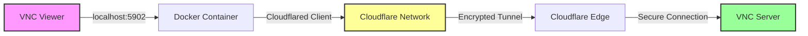

# VNC Cloudflared Docker Client

[](https://www.docker.com/)
[](https://www.cloudflare.com/)
[](https://opensource.org/licenses/MIT)
[](https://github.com/SGT-Cho/cloudflared-tunnel-vnc-docker-client/actions)
[](CONTRIBUTING.md)

A secure, dockerized VNC client that connects through Cloudflare Tunnel, providing encrypted remote desktop access without exposing ports.

## 📖 Table of Contents

- [Features](#-features)
- [Quick Start](#-quick-start)
- [Detailed Installation](#-detailed-installation)
- [Configuration Guide](#-configuration-guide)
- [Usage Examples](#-usage-examples)
- [Troubleshooting](#-troubleshooting)
- [Architecture](#-architecture)
- [Contributing](#-contributing)

## ✨ Features

- 🔒 **End-to-End Encryption** - All traffic secured through Cloudflare's network
- 🐳 **Fully Containerized** - One-command deployment with Docker
- 🚀 **Multiple Profile Support** - Connect to different servers easily
- 🔄 **Auto-reconnection** - Automatic recovery from network issues
- 📊 **Built-in Monitoring** - Health checks and metrics
- 🎯 **Zero Port Exposure** - No inbound ports on your server
- 🔍 **Auto Authentication** - Detects and displays auth URLs
- 🧪 **Connection Testing** - Verify connectivity before use

## 🚀 Quick Start

```bash
# 1. Clone the repository
git clone https://github.com/SGT-Cho/cloudflared-tunnel-vnc-docker-client.git
cd cloudflared-tunnel-vnc-docker-client

# 2. Configure your VNC hostname
cp .env.example .env
nano .env  # Set VNC_HOSTNAME=vnc.yourdomain.com

# 3. Start the tunnel
./vnc-client.sh start

# 4. Connect with any VNC viewer to localhost:5902
```

## 📋 Detailed Installation

### Prerequisites

Before starting, ensure you have:

- ✅ Docker Engine 20.10+ installed
- ✅ Docker Compose v2.0+ installed
- ✅ A Cloudflare account with a domain
- ✅ VNC server with Cloudflare Tunnel configured

### Step 1: Install Docker

<details>
<summary>🐧 Linux Installation</summary>

```bash
# Ubuntu/Debian
curl -fsSL https://get.docker.com -o get-docker.sh
sudo sh get-docker.sh
sudo usermod -aG docker $USER
newgrp docker

# Verify installation
docker --version
```
</details>

<details>
<summary>🍎 macOS Installation</summary>

```bash
# Using Homebrew
brew install --cask docker

# Or download Docker Desktop from:
# https://www.docker.com/products/docker-desktop/
```
</details>

<details>
<summary>🪟 Windows Installation</summary>

1. Download [Docker Desktop for Windows](https://www.docker.com/products/docker-desktop/)
2. Enable WSL2 during installation
3. Open PowerShell and verify:
```powershell
docker --version
```
</details>

### Step 2: Clone and Configure

```bash
# Clone the repository
git clone https://github.com/SGT-Cho/cloudflared-tunnel-vnc-docker-client.git
cd cloudflared-tunnel-vnc-docker-client

# Make script executable
chmod +x vnc-client.sh

# Copy environment template
cp .env.example .env
```

### Step 3: Configure Environment

Edit `.env` file with your settings:

```bash
# Required configuration
VNC_HOSTNAME=vnc.yourdomain.com  # Your Cloudflare tunnel hostname

# Optional settings
VNC_LOCAL_PORT=5902              # Local port (default: 5902)
TUNNEL_LOGLEVEL=info             # Log level: debug, info, warn, error
TZ=America/New_York              # Your timezone
```

### Step 4: First Run

```bash
# Start the tunnel
./vnc-client.sh start
```

Expected output:
```
[2025-01-20 10:30:00] Starting VNC tunnel (profile: default)...
[INFO] Building cloudflared image...
[INFO] Starting services...
[2025-01-20 10:30:05] ✅ VNC tunnel started successfully!
[INFO] Local VNC port: 5902
[INFO] Remote hostname: vnc.yourdomain.com
[WARN] Please open this URL in your browser to authenticate:
https://yourdomain.cloudflareaccess.com/cdn-cgi/access/cli?...
```

### Step 5: Authenticate (First Time Only)

1. Copy the authentication URL from the logs
2. Open it in your browser
3. Complete Cloudflare Access authentication
4. Return to terminal - tunnel should now be active

### Step 6: Connect with VNC Viewer

1. Open your VNC viewer (RealVNC, TightVNC, etc.)
2. Connect to: `localhost:5902`
3. Enter your VNC password when prompted

## 🔧 Configuration Guide

### Basic Configuration

| Variable | Description | Default | Required |
|----------|-------------|---------|----------|
| `VNC_HOSTNAME` | Cloudflare tunnel hostname | - | ✅ Yes |
| `VNC_LOCAL_PORT` | Local port for VNC | 5902 | ❌ No |
| `TUNNEL_LOGLEVEL` | Logging verbosity | info | ❌ No |
| `TZ` | Container timezone | UTC | ❌ No |

### Advanced Configuration

<details>
<summary>🔧 View all configuration options</summary>

| Variable | Description | Default |
|----------|-------------|---------|
| `TUNNEL_TRANSPORT_LOGLEVEL` | Transport layer logging | warn |
| `TUNNEL_RETRIES` | Connection retry attempts | 5 |
| `TUNNEL_GRACE_PERIOD` | Shutdown grace period | 30s |
| `CONTAINER_CPU_LIMIT` | CPU usage limit | 0.5 |
| `CONTAINER_MEMORY_LIMIT` | Memory limit | 256M |
| `HEALTHCHECK_INTERVAL` | Health check frequency | 30s |
| `LOG_MAX_SIZE` | Maximum log file size | 10m |
| `LOG_MAX_FILES` | Log files to keep | 3 |
</details>

### Multiple Profiles

Run multiple VNC tunnels simultaneously:

```bash
# Create profile-specific configs
cp .env .env.production
cp .env .env.development

# Edit each file with different settings:
# .env.production: VNC_HOSTNAME=vnc-prod.company.com, VNC_LOCAL_PORT=5902
# .env.development: VNC_HOSTNAME=vnc-dev.company.com, VNC_LOCAL_PORT=5903

# Start specific profiles
./vnc-client.sh start production
./vnc-client.sh start development
```

## 📚 Usage Examples

### Common Commands

```bash
# Start tunnel
./vnc-client.sh start

# Check status
./vnc-client.sh status

# View logs
./vnc-client.sh logs

# Test connection
./vnc-client.sh test

# Stop tunnel
./vnc-client.sh stop

# Update cloudflared
./vnc-client.sh update
```

### Real-World Scenarios

<details>
<summary>🏢 Corporate VPN Alternative</summary>

Replace VPN with secure VNC access:

```bash
# Production server
VNC_HOSTNAME=prod-desktop.company.com ./vnc-client.sh start production

# Development server
VNC_HOSTNAME=dev-desktop.company.com ./vnc-client.sh start development

# Connect to prod: localhost:5902
# Connect to dev: localhost:5903
```
</details>

<details>
<summary>🏠 Home Lab Access</summary>

Access your home lab from anywhere:

```bash
# Configure multiple machines
for host in gpu-server nas-admin plex-server; do
  echo "VNC_HOSTNAME=${host}.mydomain.com" > .env.${host}
  echo "VNC_LOCAL_PORT=$((5900 + ${#host}))" >> .env.${host}
done

# Start all connections
for host in gpu-server nas-admin plex-server; do
  ./vnc-client.sh start ${host}
done
```
</details>

<details>
<summary>🔧 Remote Support</summary>

Quick remote support setup:

```bash
# Generate temporary access
SUPPORT_TOKEN=$(openssl rand -hex 16)
echo "VNC_HOSTNAME=support-${SUPPORT_TOKEN}.domain.com" > .env.support

# Start support session
./vnc-client.sh start support

# Share localhost:5902 access details
# Stop when done
./vnc-client.sh stop support
```
</details>

## 🚨 Troubleshooting

### Common Issues and Solutions

<details>
<summary>❌ Authentication URL not appearing</summary>

**Problem**: No authentication URL in logs

**Solution**:
```bash
# Check logs for URL
./vnc-client.sh logs | grep https://

# If no URL, restart tunnel
./vnc-client.sh restart

# Still no URL? Check Cloudflare Access settings
```
</details>

<details>
<summary>❌ Connection refused on localhost:5902</summary>

**Problem**: VNC Viewer cannot connect

**Solution**:
```bash
# 1. Test connection
./vnc-client.sh test

# 2. Check if port is in use
lsof -i :5902

# 3. Try different port
echo "VNC_LOCAL_PORT=5903" >> .env
./vnc-client.sh restart
```
</details>

<details>
<summary>❌ Docker permission denied</summary>

**Problem**: Cannot access Docker daemon

**Solution**:
```bash
# Linux: Add user to docker group
sudo usermod -aG docker $USER
newgrp docker

# macOS/Windows: Ensure Docker Desktop is running
```
</details>

<details>
<summary>❌ Tunnel keeps disconnecting</summary>

**Problem**: Frequent connection drops

**Solution**:
```bash
# 1. Increase retry attempts
echo "TUNNEL_RETRIES=10" >> .env

# 2. Enable debug logging
echo "TUNNEL_LOGLEVEL=debug" >> .env

# 3. Check network stability
./vnc-client.sh restart
./vnc-client.sh logs  # Monitor for errors
```
</details>

### Debug Mode

For complex issues, use debug mode:

```bash
# Enter interactive debug mode
./vnc-client.sh debug

# This will show:
# - Environment variables
# - Container logs
# - Network configuration
# - Volume information
# - Container shell access
```

## 🏗️ Architecture



### Security Features

- **End-to-End Encryption**: TLS 1.3 throughout
- **Zero Trust Access**: Cloudflare authentication
- **No Port Exposure**: Server requires no inbound ports
- **Container Isolation**: Limited privileges and resources
- **Automatic Updates**: Keep cloudflared current

## 🤝 Contributing

We welcome contributions! See [CONTRIBUTING.md](CONTRIBUTING.md) for guidelines.

### Quick Contribution Guide

1. Fork the repository
2. Create your feature branch (`git checkout -b feature/amazing-feature`)
3. Commit changes (`git commit -m 'Add amazing feature'`)
4. Push to branch (`git push origin feature/amazing-feature`)
5. Open a Pull Request

## 📄 License

This project is licensed under the MIT License - see [LICENSE](LICENSE) file.

## 🙏 Acknowledgments

- [Cloudflare](https://www.cloudflare.com/) for their excellent tunnel service
- [Docker](https://www.docker.com/) for containerization
- The open-source community for inspiration

## 💬 Support

- 📧 [Open an issue](https://github.com/SGT-Cho/cloudflared-tunnel-vnc-docker-client/issues) for bugs
- 💡 [Start a discussion](https://github.com/SGT-Cho/cloudflared-tunnel-vnc-docker-client/discussions) for questions
- 📖 Check [detailed docs](docs/) for more information

---

<p align="center">
  Made with ❤️ by the open-source community<br>
  Star ⭐ this repo if you find it helpful!
</p>